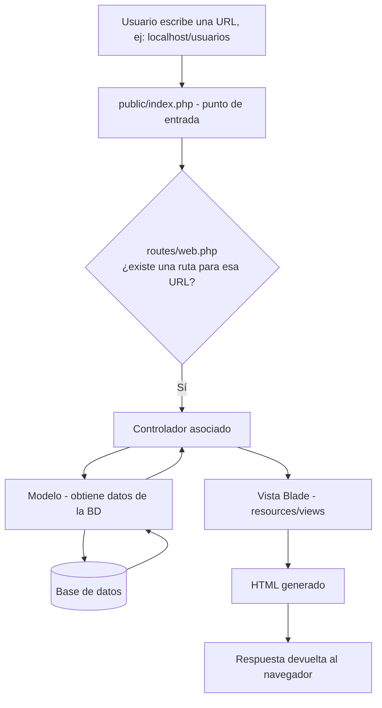

# SGE - Sistema de Gestión Empresarial

# Análisis de la Empresa

## 1. Datos Generales
- **Nombre:** Biblioteca COTECNOVA
- **Giro del negocio:** Gestión del catálogo bibliográfico y administración del préstamo e inventario de libros de una biblioteca institucional.
- **Tamaño:** Pequeña

## 2. Procesos Clave
- **Ventas:** El negocio no maneja ventas comerciales; se opera un servicio de préstamo de libros. Cada préstamo registra fecha de préstamo, fecha límite de devolución, fecha real de devolución y si aplica, el valor de la multa por retraso. El dashboard calcula sobre estos datos indicadores como préstamos activos, préstamos vencidos y multas pendientes.
- **Compras:** La biblioteca adquiere nuevos títulos a distintas editoriales o diferentes librerías (por ejemplo Pearson, McGraw-Hill, Alfaomega, Planeta, Trillas, Norma, Anaya, Penguin Random House, O'Reilly Media y Santillana) para ampliar el catálogo dependiendo las necesidades de los estudiantes y profesores.
- **Inventario:** Cada libro registra un campo `stock` que indica la cantidad de ejemplares disponibles. El sistema alerta cuando el stock de un título cae por debajo de un umbral mínimo. A nivel de modelo de negocio cada libro puede tener varios ejemplares físicos individuales, cada uno con su propia ubicación, código de barras, signatura y fecha de adquisición.
- **Otros:** Los usuarios se identifican con el tipo de identificación (CC.TI. etc) y el número de este, editoriales y géneros como catálogos de apoyo. Por ahora solo se tiene el rol de administrador (Bibliotecario) permitiendo visualizar el panel de administrador (dashboard) con la lista de libros, usuarios con su correo verificado, prestamos y multas.

## 3. Entidades Identificadas (Tablas)

**Implementadas en la base de datos (con migraciones):**
- Usuarios (`users`)
- Editoriales (`editorials`)
- Géneros (`generos`)
- Libros (`libros`)

**Identificadas en el modelo de negocio, usadas actualmente solo como datos de apoyo (datos CSV simulados) para las estadísticas del dashboard, aún no migradas a la base de datos:**
- Autor
- Ejemplar (copia física individual de un libro: código de barras, signatura, ubicación, fecha de adquisición)
- Ubicación (zona/estante/nivel donde se guarda cada ejemplar)
- Préstamo (registro de préstamo por usuario, con fechas y multas)
- Tablas de relación: libro-género (muchos a muchos), autor-libro (muchos a muchos), préstamo-ejemplar

Estas entidades son las utilizadas en este avance del proyecto ayudándonos como tal a generar un sistema funcional `users`, `editorials`, `generos` y `libros`.

## 4. Diccionario de Datos

### Tabla: users
| Campo | Tipo | Descripción |
|---|---|---|
| id | BIGINT | Identificador único del usuario |
| name | VARCHAR(255) | Nombre del usuario |
| tipo_identificacion | VARCHAR(10), nullable | Tipo de documento de identificación (CC, TI, etc.) |
| numero_identificacion | VARCHAR(30), nullable | Número del documento de identificación |
| email | VARCHAR(255), único | Correo electrónico del usuario |
| email_verified_at | TIMESTAMP, nullable | Fecha de verificación del correo |
| password | VARCHAR(255) | Contraseña encriptada |
| remember_token | VARCHAR(100), nullable | Token para sesión persistente |
| created_at | TIMESTAMP | Fecha de creación del registro |
| updated_at | TIMESTAMP | Fecha de última actualización |

### Tabla: editorials
| Campo | Tipo | Descripción |
|---|---|---|
| id | BIGINT | Identificador único de la editorial |
| nombre | VARCHAR(100) | Nombre de la casa editorial |
| created_at | TIMESTAMP | Fecha de creación del registro |
| updated_at | TIMESTAMP | Fecha de última actualización |

### Tabla: generos
| Campo | Tipo | Descripción |
|---|---|---|
| id | BIGINT | Identificador único del género |
| nombre | VARCHAR(50) | Nombre del género o categoría temática del libro |
| created_at | TIMESTAMP | Fecha de creación del registro |
| updated_at | TIMESTAMP | Fecha de última actualización |

### Tabla: libros
| Campo | Tipo | Descripción |
|---|---|---|
| id | BIGINT | Identificador único del libro |
| titulo | VARCHAR(150) | Título del libro |
| descripcion | TEXT, nullable | Breve descripción o sinopsis del libro |
| portada_url | VARCHAR(255), nullable | URL de la imagen de portada |
| stock | INTEGER, default 0 | Cantidad de ejemplares disponibles para préstamo |
| isbn | VARCHAR(20), nullable | Código ISBN del libro |
| editorial_id | BIGINT, FK → editorials.id | Editorial que publicó el libro |
| genero_id | BIGINT, FK → generos.id | Género temático del libro |
| created_at | TIMESTAMP | Fecha de creación del registro |
| updated_at | TIMESTAMP | Fecha de última actualización |

## 5. Diagrama Entidad-Relación (MER)


**Relaciones principales (entidades implementadas):**
- `Editorial` 1:N `Libro` (una editorial publica muchos libros; cada libro pertenece a una editorial)
- `Genero` 1:N `Libro` (un género agrupa muchos libros; cada libro pertenece a un género)
- `User` consulta y gestiona el catálogo (autenticación para administrar libros, editoriales y géneros)

## Semana 2: Instalación de Laravel

### 2.1 Requisitos 

- PHP 8.2 o superior
- Composer
- Docker Desktop (con WSL2)

### 2.2 Pasos de la instalación

1. Clonar el repositorio:
   ```bash
   git clone <https://github.com/manuela-aguirre/SGE-Clase3.git>
   cd sge
   ```

2. Instalar las dependencias de PHP con Composer:
   ```bash
   composer install
   ```

3. Copiar el archivo de variables de entorno de ejemplo:
   ```bash
   cp .env
   ```

4. Generar la clave de aplicación:
   ```bash
   php artisan key:generate
   ```

5. Instalar Laravel Sail como dependencia de desarrollo (si el proyecto aún no lo incluye):
  ```bash
   composer require laravel/sail --dev
   php artisan sail:install
   ```
   Durante la instalación se selecciona el servicio `mysql`. Esto genera el archivo `compose.yml` (docker-compose) en la raíz del proyecto para usar los contenedores.

6. Levantar el entorno de desarrollo con Sail:
   ```bash
   ./vendor/bin/sail up -d
   ```
   - `up` levanta los contenedores definidos en `compose.yml`.
   - `-d` los ejecuta en segundo plano, dejando la terminal libre.
   - La primera vez puede tardar varios minutos porque descarga las imágenes de Docker.

7. Verificar que los contenedores quedaron activos:
   ```bash
   docker ps
   ```
   Deben aparecer los servicios `laravel.test` (PHP + servidor web) y `mysql` (la base de datos).

8. Ejecutar las migraciones para crear las tablas base (`users`, `sessions`, `failed_jobs`, etc.):
   ```bash
   ./vendor/bin/sail artisan migrate
   ```

9. Acceder a la aplicación en el navegador:
   ```
   http://localhost
   ```
    Sail usa el puerto 80 por defecto, no el 8000. Si el puerto 80 ya está ocupado en el equipo, se puede cambiar la variable `APP_PORT` en el `.env` (ej. `APP_PORT=8080`) y reiniciar con `./vendor/bin/sail down` y `./vendor/bin/sail up -d`.

Para detener el entorno:
```bash
./vendor/bin/sail down
```

---

## 2.3 Estructura de carpetas

Al ejecutar `composer create-project` (o clonar un proyecto Laravel ya creado), el framework genera la siguiente estructura:

| Carpeta | Función |
|---|---|
| `app/` | Contiene el núcleo de la aplicación: Modelos, Controladores y la lógica de negocio. |
| `bootstrap/` | Archivos que "arrancan" el framework. Casi nunca se modifica. |
| `config/` | Archivos de configuración de Laravel (base de datos, mail, caché, etc.). |
| `database/` | Migraciones, seeders y factories, usados para crear y poblar la base de datos. |
| `public/` | Punto de entrada de la aplicación (`index.php`). Aquí van también CSS, JS e imágenes públicas. |
| `resources/` | Vistas Blade y archivos CSS/JS sin compilar. |
| `routes/` | Definición de todas las rutas (URLs) de la aplicación (`web.php`, `api.php`, etc.). |
| `storage/` | Archivos generados por Laravel: logs, caché y sesiones. |
| `vendor/` | Todas las dependencias instaladas por Composer. No se toca manualmente ni se sube al repositorio. |
| `.env` | Variables de entorno específicas de cada instalación. No se sube al repositorio. |

### Patrón MVC (Modelo–Vista–Controlador)

Laravel organiza la aplicación siguiendo el patrón **MVC**, que separa la aplicación en tres componentes:

1. **Modelo (M):** Representa los datos y la lógica de negocio. Habla con la base de datos. En Laravel vive en `app/Models/`.
2. **Vista (V):** Es lo que el usuario ve, o sea, la interfaz. En Laravel vive en `resources/views/` y usa el motor de plantillas **Blade**.
3. **Controlador (C):** Recibe las peticiones del usuario, consulta al Modelo para obtener datos y decide qué Vista mostrar. En Laravel vive en `app/Http/Controllers/`.

Esto es útil porque separa responsabilidades, facilita el mantenimiento y permite que distintas personas trabajen en Vistas y en Modelos/Controladores sin pisarse el trabajo.

---

## 2.4 Diagrama del flujo de una petición

Esquema general del flujo en Laravel:

```
Usuario → Ruta (routes/web.php) → Controlador → Modelo → BD
                                                            ↓
                    ← Respuesta ← Vista ← Controlador ←
```



**Paso a paso (¿Qué pasa cuando un usuario escribe una URL en el navegador?):**

1. El usuario escribe, por ejemplo, `http://localhost/usuarios`.
2. El archivo `public/index.php` recibe la petición (es el punto de entrada de toda la aplicación).
3. Laravel busca en `routes/web.php` si existe una ruta definida para `/usuarios`.
4. Si existe, ejecuta el Controlador asociado a esa ruta.
5. El Controlador usa el Modelo para obtener los datos necesarios desde la base de datos.
6. El Controlador pasa esos datos a una Vista.
7. La Vista genera el HTML final.
8. Laravel devuelve ese HTML como respuesta al navegador del usuario.

---

## 2.5 Variables de entorno

El archivo `.env` contiene las **variables de entorno** de la aplicación: configuraciones que cambian según el entorno donde corre el proyecto (local, pruebas, producción). Es importante porque:

- Separa la configuración del código.
- Permite tener configuraciones distintas en local y en producción.
- **Nunca se sube a GitHub** (debe estar en `.gitignore`).

| Variable | ¿Qué configura? | Ejemplo |
|---|---|---|
| `APP_NAME` | Nombre de la aplicación | `SGE` |
| `APP_ENV` | Entorno de ejecución | `local` |
| `APP_DEBUG` | Modo depuración (muestra errores detallados) | `true` |
| `APP_URL` | URL base de la aplicación | `http://localhost` |
| `DB_CONNECTION` | Motor de base de datos | `mysql` |
| `DB_HOST` | Host de la base de datos | `mysql` (nombre del servicio en Sail) |
| `DB_PORT` | Puerto de conexión a la base de datos | `3306` |
| `DB_DATABASE` | Nombre de la base de datos | `laravel` |
| `DB_USERNAME` | Usuario de la base de datos | `sail` |
| `DB_PASSWORD` | Contraseña del usuario de la base de datos | `password` |


