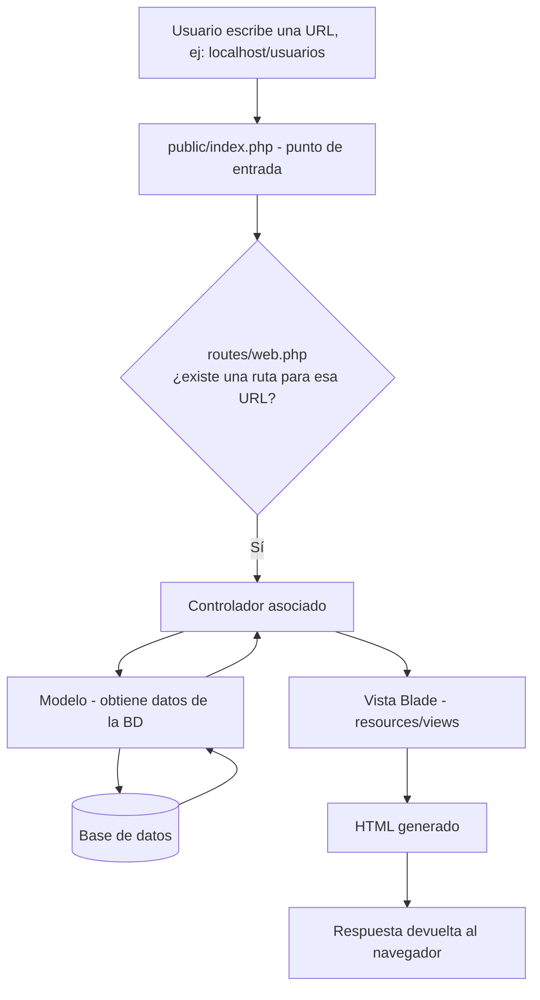

# SGE - Sistema de Gestión Empresarial

## Capítulo 2: Instalación de Laravel

### 2.1 Requisitos previos

- PHP 8.2 o superior
- Composer
- Docker Desktop (con WSL2 habilitado en Windows)

### 2.2 Pasos de instalación

1. Clonar el repositorio:
   ```bash
   git clone <https://github.com/manuela-aguirre/SGE-Clase3.git>
   cd sge
   ```

2. Instalar las dependencias de PHP con Composer:
   ```bash
   composer install
   ```

3. Copiar el archivo de variables de entorno de ejemplo:
   ```bash
   cp .env.example .env
   ```

4. Generar la clave de aplicación:
   ```bash
   php artisan key:generate
   ```

5. Instalar Laravel Sail como dependencia de desarrollo (si el proyecto aún no lo incluye):
  ```bash
   composer require laravel/sail --dev
   php artisan sail:install
   ```
   Durante la instalación se selecciona el servicio `mysql`. Esto genera el archivo `compose.yml` (docker-compose) en la raíz del proyecto.

6. Levantar el entorno de desarrollo con Sail:
   ```bash
   ./vendor/bin/sail up -d
   ```
   - `up` levanta los contenedores definidos en `compose.yml`.
   - `-d` los ejecuta en segundo plano ("detached"), dejando la terminal libre.
   - La primera vez puede tardar varios minutos porque descarga las imágenes de Docker.

7. Verificar que los contenedores quedaron activos:
   ```bash
   docker ps
   ```
   Deben aparecer los servicios `laravel.test` (PHP + servidor web) y `mysql` (base de datos).

8. Ejecutar las migraciones para crear las tablas base (`users`, `sessions`, `failed_jobs`, etc.):
   ```bash
   ./vendor/bin/sail artisan migrate
   ```

9. Acceder a la aplicación en el navegador:
   ```
   http://localhost
   ```
   **Nota:** Sail usa el puerto **80** por defecto, no el 8000. Si el puerto 80 ya está ocupado en el equipo, se puede cambiar la variable `APP_PORT` en el `.env` (ej. `APP_PORT=8080`) y reiniciar con `./vendor/bin/sail down` y `./vendor/bin/sail up -d`.

Para detener el entorno:
```bash
./vendor/bin/sail down
```

---

## 2.3 Estructura de carpetas

Al ejecutar `composer create-project` (o clonar un proyecto Laravel ya creado), el framework genera la siguiente estructura:

| Carpeta | Función |
|---|---|
| `app/` | Contiene el núcleo de la aplicación: Modelos, Controladores y la lógica de negocio. |
| `bootstrap/` | Archivos que "arrancan" el framework. Casi nunca se modifica. |
| `config/` | Archivos de configuración de Laravel (base de datos, mail, caché, etc.). |
| `database/` | Migraciones, seeders y factories, usados para crear y poblar la base de datos. |
| `public/` | Punto de entrada de la aplicación (`index.php`). Aquí van también CSS, JS e imágenes públicas. |
| `resources/` | Vistas Blade y archivos CSS/JS sin compilar. |
| `routes/` | Definición de todas las rutas (URLs) de la aplicación (`web.php`, `api.php`, etc.). |
| `storage/` | Archivos generados por Laravel: logs, caché y sesiones. |
| `vendor/` | Todas las dependencias instaladas por Composer. No se toca manualmente ni se sube al repositorio. |
| `.env` | Variables de entorno específicas de cada instalación. No se sube al repositorio. |

### Patrón MVC (Modelo–Vista–Controlador)

Laravel organiza la aplicación siguiendo el patrón **MVC**, que separa la aplicación en tres componentes:

1. **Modelo (M):** representa los datos y la lógica de negocio; habla con la base de datos. En Laravel vive en `app/Models/`.
2. **Vista (V):** es lo que el usuario ve, la interfaz. En Laravel vive en `resources/views/` y usa el motor de plantillas **Blade**.
3. **Controlador (C):** recibe las peticiones del usuario, consulta al Modelo para obtener datos y decide qué Vista mostrar. En Laravel vive en `app/Http/Controllers/`.

**Analogía (un restaurante):**
- **Modelo** = la cocina (donde se preparan los datos).
- **Vista** = el menú y la presentación del plato (lo que ve el cliente).
- **Controlador** = el mesero (recibe el pedido, va a la cocina, trae la comida).

Esto es útil porque separa responsabilidades, facilita el mantenimiento y permite que distintas personas trabajen en Vistas y en Modelos/Controladores sin pisarse el trabajo.

---

## 2.4 Diagrama del flujo de una petición

Esquema general del flujo en Laravel:

```
Usuario → Ruta (routes/web.php) → Controlador → Modelo → BD
                                                            ↓
                    ← Respuesta ← Vista ← Controlador ←
```



**Paso a paso (¿qué pasa cuando un usuario escribe una URL en el navegador?):**

1. El usuario escribe, por ejemplo, `http://localhost/usuarios`.
2. El archivo `public/index.php` recibe la petición (es el punto de entrada de toda la aplicación).
3. Laravel busca en `routes/web.php` si existe una ruta definida para `/usuarios`.
4. Si existe, ejecuta el Controlador asociado a esa ruta.
5. El Controlador usa el Modelo para obtener los datos necesarios desde la base de datos.
6. El Controlador pasa esos datos a una Vista.
7. La Vista genera el HTML final.
8. Laravel devuelve ese HTML como respuesta al navegador del usuario.

---

## 2.5 Variables de entorno

El archivo `.env` contiene las **variables de entorno** de la aplicación: configuraciones que cambian según el entorno donde corre el proyecto (local, pruebas, producción). Es importante porque:

- Separa la configuración del código.
- Permite tener configuraciones distintas en local y en producción.
- **Nunca se sube a GitHub** (debe estar en `.gitignore`).

| Variable | ¿Qué configura? | Ejemplo |
|---|---|---|
| `APP_NAME` | Nombre de la aplicación | `SGE` |
| `APP_ENV` | Entorno de ejecución | `local` |
| `APP_DEBUG` | Modo depuración (muestra errores detallados) | `true` |
| `APP_URL` | URL base de la aplicación | `http://localhost` |
| `DB_CONNECTION` | Motor de base de datos | `mysql` |
| `DB_HOST` | Host de la base de datos | `mysql` (nombre del servicio en Sail) |
| `DB_PORT` | Puerto de conexión a la base de datos | `3306` |
| `DB_DATABASE` | Nombre de la base de datos | `laravel` |
| `DB_USERNAME` | Usuario de la base de datos | `sail` |
| `DB_PASSWORD` | Contraseña del usuario de la base de datos | `password` |

**Importante:** cuando se usa Sail, `DB_HOST` debe ser `mysql` (el nombre del servicio definido en `compose.yml`), **no** `localhost` ni `127.0.0.1`, porque la base de datos corre dentro de un contenedor Docker distinto al de la aplicación.

El archivo `.env.example` sí se incluye en el repositorio como plantilla, con valores vacíos o genéricos, para que cada integrante del equipo cree su propio `.env` local sin exponer credenciales reales.

---

## Notas sobre esta entrega

- Las capturas de pantalla solicitadas se encuentran en la carpeta `capturas/`.
- El archivo `.env` y la carpeta `vendor/` están excluidos del repositorio mediante `.gitignore`, siguiendo las buenas prácticas de Laravel.
